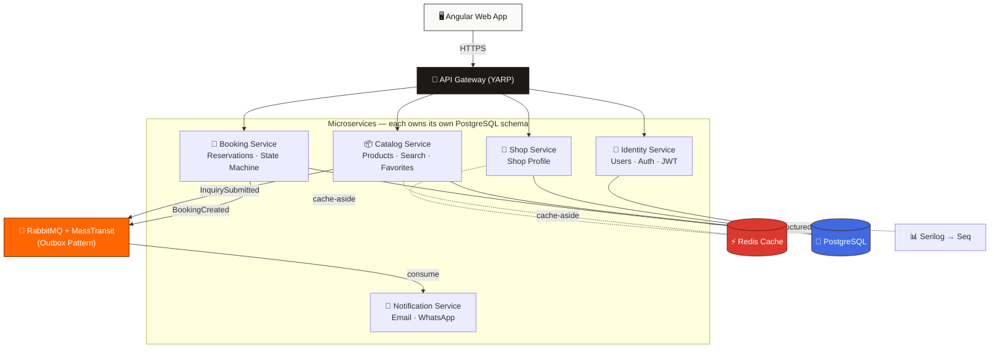

<div align="center">


<a href="#">
  
</a>

<br/>


</div>

<br/>

## 📖 About The Project

**Alasturu** started as a real-world problem: small and mid-size furniture workshops rely on physical showrooms, social media DMs, and manual follow-up. Prices get asked ten times, booking requests get lost in chat threads, and there's no clear state for a piece — *available, reserved, sold, hidden?* Nobody knows.

This project solves that with a proper digital catalog: **browse → search → inquire → book**, backed by an architecture built to production-grade standards — not a toy CRUD app.

It's deliberately built as **Single-Shop first**, with every architectural decision made so it can evolve into a **Multi-Vendor Marketplace** later, without a rewrite.

> 🎯 **Dual purpose:** a real product for a real furniture shop, and a serious portfolio piece demonstrating production-level .NET engineering — Microservices, Event-Driven Architecture, Observability, and full-spectrum testing (QA is learned and applied *alongside* every phase of this build, not bolted on at the end).

<br/>

## 🧩 Core Features

<table>
<tr>
<td width="50%" valign="top">

**🛋️ For Customers**
- Browse a full product catalog with rich filtering
- PostgreSQL Full-Text Search (relevance-ranked)
- Favorites, product inquiries, reviews
- Structured booking flow with live status
- Email / WhatsApp notifications

</td>
<td width="50%" valign="top">

**🏪 For Shop Owners**
- Manage products, images, and inventory state
- Accept / reject / complete bookings
- Respond to customer inquiries
- View analytics: views, favorites, conversion
- Full shop profile management

</td>
</tr>
</table>

<br/>

## 🏗️ Architecture

Built as **disciplined Microservices** — enough separation to show real engineering judgment, without over-fragmenting a portfolio-scale system.



**Every service follows Clean Architecture internally:**

```
Domain  →  Application  →  Infrastructure  →  Api
(rules)    (use cases)     (EF Core, etc.)   (endpoints)
```

The dependency arrows only ever point **inward**. The Domain layer never knows PostgreSQL, RabbitMQ, or HTTP exist — swap any of them out, the business rules don't change.

<br/>

## 🛠️ Tech Stack

<div align="center">


</div>

| Layer | Technology | Why |
|---|---|---|
| **Backend** | ASP.NET Core (.NET 10), EF Core | Web API per service, Clean Architecture |
| **Database** | PostgreSQL | One schema per service + Full-Text Search (no Elasticsearch needed yet) |
| **Caching** | Redis | Cache-Aside pattern for hot reads (categories, product details) |
| **Messaging** | RabbitMQ + MassTransit | Async events, Outbox Pattern, Dead-Letter handling |
| **Background Jobs** | Hangfire | Booking expiration, notification retries |
| **Observability** | Serilog + Seq | Structured logs, Correlation ID across services |
| **Gateway** | YARP | Single entry point, routing, no business logic |
| **Frontend** | Angular + TypeScript | Reactive Forms, signals-first state |
| **Testing** | xUnit, FluentAssertions, Testcontainers, Playwright | Unit → Integration → E2E |
| **DevOps** | Docker, GitHub Actions | Reproducible local + CI/CD pipeline |

<br/>

## 🗺️ Roadmap — 20 Phases

<details>
<summary><b>Click to expand the full delivery roadmap</b></summary>
<br/>

- [x] **Phase 0** — Discovery & Final Planning
- [ ] **Phase 1** — Repository & Engineering Foundation 🚧 *(in progress)*
- [ ] **Phase 2** — Cross-Cutting Building Blocks
- [ ] **Phase 3** — Identity Service
- [ ] **Phase 4** — API Gateway
- [ ] **Phase 5** — Shop Service
- [ ] **Phase 6** — Catalog Foundation
- [ ] **Phase 7** — PostgreSQL Full-Text Search
- [ ] **Phase 8** — Favorites, Reviews & Views
- [ ] **Phase 9** — Inquiry Flow
- [ ] **Phase 10** — Booking Service *(state machine — deep QA territory)*
- [ ] **Phase 11** — RabbitMQ & MassTransit
- [ ] **Phase 12** — Notification Service
- [ ] **Phase 13** — Hangfire Jobs
- [ ] **Phase 14** — Admin Dashboard
- [ ] **Phase 15** — Observability & Hardening
- [ ] **Phase 16** — Full QA & Security Hardening
- [ ] **Phase 17** — Containerization & Staging
- [ ] **Phase 18** — CI/CD Completion
- [ ] **Phase 19** — Production Launch
- [ ] **Phase 20** — Post-Production Operations

</details>

<br/>

## 🧪 Testing Philosophy

This project is also a **QA learning ground** — every phase ships with both:

- **Manual QA** — written test plans, exploratory testing, structured bug reports per feature
- **Automated Testing** — Unit tests (business rules), Integration tests (real PostgreSQL/Redis via Testcontainers), and End-to-End flows (Playwright)

The **Booking state machine** (`Pending → Confirmed → Completed`, with `Rejected` / `Cancelled` / `Expired` branches) is treated as the flagship QA case study — it's where concurrency, idempotency, and edge-case thinking really get exercised.

<br/>

## 📂 Project Structure

```
FurnitureShopPlatform/
├── src/
│   ├── Services/
│   │   ├── Identity/      → Identity.Domain / .Application / .Infrastructure / .Api
│   │   ├── Catalog/       → (same 4-layer pattern)
│   │   ├── Shop/
│   │   ├── Booking/
│   │   └── Notification/
│   ├── Gateway/
│   │   └── ApiGateway/    → YARP routing, no business logic
│   └── BuildingBlocks/
│       └── BuildingBlocks.Common/  → shared cross-cutting code
├── tests/
├── global.json             → pins .NET SDK version
└── FurnitureShopPlatform.slnx
```

<br/>

## 🚀 Getting Started

```bash
# 1. Clone the repo
git clone https://github.com/<your-username>/FurnitureShopPlatform.git
cd FurnitureShopPlatform

# 2. Restore & build
dotnet restore
dotnet build

# 3. Spin up infrastructure (PostgreSQL, Redis, RabbitMQ, Seq)
docker compose up -d

# 4. Run a service
dotnet run --project src/Services/Identity/Identity.Api
```

<br/>

## 📊 Project Status

<div align="center">


</div>

<br/>

## 🤝 Connect

<div align="center">

<a href="#"></a>
<a href="#"></a>

*Built by Abedalqader — backend .NET developer, Irbid, Jordan.*

</div>


